# MasterBots

**MasterBots is a UX-focused open-source chatbot aggregator platform and an alternative to ChatGPT.**

## Table of Contents

- [MasterBots](#masterbots)
  - [Table of Contents](#table-of-contents)
  - [Introduction](#introduction)
  - [Features](#features)
  - [Requirements](#requirements)
  - [Setup Instructions](#setup-instructions)
    - [Running the Backend](#running-the-backend)
    - [Running the Frontend](#running-the-frontend)
    - [Development Guidelines](#development-guidelines)
  - [Site Map Diagram](#site-map-diagram)
    - [Contributing](#contributing)
    - [License](#license)

## Introduction

MasterBots addresses several key issues with current chatbot platforms like ChatGPT:

1. **Organization**: ChatGPT threads are hard to organize, and most users are not skilled at prompting. MasterBots organizes bots by categories and domain expertise, providing prompt-tuned and fine-tuned experiences from the start.
2. **Efficiency**: ChatGPT and LLMs focus on inference, which is slow and costly. MasterBots reuses generations, making user-generated content public for browsing and routing chat requests via lexical vector search before using an LLM.
3. **Cost and Speed**: ChatGPT & GPT-4 are expensive and slow. MasterBots leverages fine-tuned open-source small models, which are cheaper and faster.
4. **User Experience**: ChatGPT's UX is basic. MasterBots improves UX by organizing responses based on category and domain expertise, offering easy response customizations, and making responses clickable for further questions.

MasterBots is open-source and built in public. Contributors earn platform credits that can be sold for cash.

## Features

- **Next.js**: App Router, React Server Components (RSCs), Suspense, and Server Actions.
- **Vercel AI SDK**: For streaming chat UI.
- **Styling**: Tailwind CSS, Radix UI for headless component primitives, and Phosphor Icons.
- **Storage**: Chat History, rate limiting, and session storage with Vercel KV.
- **Authentication**: NextAuth.js for authentication.
- **Model Providers**: Support for OpenAI, Anthropic, Cohere, Hugging Face, or custom AI chat models and/or LangChain.

## Requirements

- NodeJS (recommend using [nvm](https://github.com/nvm-sh/nvm) for version switching)
- [Hasura CLI](https://hasura.io/docs/latest/hasura-cli/overview)
- [pnpm](https://pnpm.io/) package manager
- [Docker](https://docs.docker.com/engine/install/) and [Docker Compose](https://docs.docker.com/compose/install/)
- [Task](https://taskfile.dev) task manager

## Setup Instructions

### Running the Backend

1. Create an `.env` file in the root folder based on `.env_sample`.
2. Use `task` to execute the following commands to operate Hasura locally:

- **boot**: Boots up the database and Hasura services, with a delay to ensure proper startup, followed by running migrations.
- **reboot**: Shuts down and then restarts the services.
- **seed**: Applies seed data to the Hasura project.
- **console**: Launches the Hasura console for the specified project.
- **migrate**: Applies database migrations and updates Hasura metadata.
- **reload**: Restarts the Postgres service, then all services, and tails the Hasura logs.
- **up**: Starts all services defined in the Docker Compose file with a build.
- **down**: Shuts down all services and removes any orphaned containers.

### Running the Frontend

1. Set up the `.env` file in the `apps/masterbots.ai` folder (refer to `.env_sample`).
2. Run the following commands:

```sh
bun install
turbo run dev --scope="masterbots.ai"
# or use task to execute the same command
task app
```

### Development Guidelines

- Optimize GraphQL Queries: Minimize data transfer and improve performance by fetching only necessary fields and using appropriate filters and pagination.
- Error Handling and Logging: Implement proper error handling and logging mechanisms to aid in debugging and monitoring.
- Maintain Dependencies and Docker Images: Regularly update and maintain dependencies and Docker images to ensure security and compatibility.

## Site Map Diagram

```mermaid
---
config:
  themeVariables:
    background: '#f3f5f4'
    primaryColor: '#AABDC0'
    primaryBorderColor: '#E4A4B1'
    primaryTextColor: '#300047'
    lineColor: '#0E0036'
    fontSize: 26px
---

flowchart TB
    HOST{"\nDOMAIN NAME - Default\nmasterbots.ai\n\n"} -- Filter content by country --> HOST_COUNTRY{"\nDOMAIN NAME - Country Specific\nmasterbots.ai.cr\n\n"}
    HOST -- Filter content by language --> HOST_LANG{"\nDOMAIN NAME - Language sub-path\nmasterbots.ai/en\n\n"}
    HOST_LANG <-- Both can cohexist. --> HOST_COUNTRY
    HOST_COUNTRY -- Can have different languages\nE.g.: masterbots.ai.cr/fr\n(Costa Rica content in French) --> HOST_LANG
    HOST --> HOME{"\nBROWSE\n/\n\n"}
    HOST_LANG --> HOME
    HOST_COUNTRY --> HOME
    MODEL_FILTER{"FILTERING MODELS - Users & Ai Web Crawlers\n?model=${ModelType}*\n\n\n*Query param applies on all routes and\nis saved on cookies and user profile (if any)"} --o HOME
    PRO_VER{"\nCHAT PRO Ver.\n/c/p\n\n"} -- when user is not a pro, we then start to\nhit the API for subscription --> API_PAYMENT_INTEND[("\n\n\nPOST and DELETE Stripe Subscriber & Payment Profile\n/api/payment/intent\n\n\n")]
    PRO_VER -- on task creation\n as pro, we --> API_CHAT[("\n\nPOST Multi Ai SDK\n/api/ai\n\n")]
    API_CHAT --x API_PRO_CHAT_START_PARAMS[("\n\nBody (Pro) Params to API (starting task):\n\n- WordWare model\n- promptId\n- WordWare prompt inputs\n- Set as private\n\n")] & API_CHAT_PARAMS[("\n\nBody params to API (start & continuing task):\n\n- Pro mode off\n- Claude3 (haiku), GPT3.5-turbo or llama3 models*\n- Set as public thread by default**\n- Chat content (sys prompt incl.)\n\n\n*The model is selected by the user on profile settings\nor by system default (currently GPT3.5-turbo).\n**'BlankBot' is the only bot that by default\nis as private thread.\n\n")] & API_PRO_CHAT_PARAMS[("\n\nBody (Pro) params to API (continuing task):\n\n- Pro mode on\n- Claude3 (haiku) model\n- Chat content (sys. prompt incl.)\n- WordWare 'function calls'*\n\n\n*The function calls are provided by giving\ncontext to Ai and setting up the actions.\n\n")]
    PRO_VER -- when user is not a pro, we then fetch to\nthe API for plans --> API_PAYMENT_PLANS[("\n\n\nGET The Masterbots Subscription Plans\n/api/payment/plans\n\n\n")]
    PRO_VER --> USER_SUBSCRIPTION_INTEND["\nUser's subscription receipt and details\n/u/s/subs/[intendId]\n\n"]
    USER_SUBSCRIPTION_INTEND ----> API_PAYMENT_SUBSCRIPTION[("\n\n\nGET Subscription Details and\nPUT To Check Subscription Status\n/api/payment/subscription\n\n\n")]
    HOME -- Upon click to a thread,\nthe route updates to --o HOME_THREAD["\nBROWSE - Thread Clicked\n/{category}/{threadId}\n\n"]
    HOME -- Upon click to a category,\nthe route updates to --o HOME_CAT_CHANGED["\nBROWSE - Category Changed\n/{category}\n\n"]
    HOME -- Upon click to a Bot Avatar at\nany thread on list, site redirects to --o BOT_PROFILE{"BOT PROFILE\n/b/{botName}\n\n"}
    BOT_PROFILE --> BOT_THREAD["\nBOT THREAD (perspective)\n/b/{botName}/{threadId}\n\n"]
    HOME -- Upon click to a User Avatar at\nany thread on list, site redirects to --o USER_PROFILE{"USER PROFILE - Threads (Default)\n/u/{slug}/t\n\n"}
    HOME <--> CHAT{"\nCHAT\n/c\n\n"} & PRO_VER
    HOME_CAT_CHANGED --> HOME_THREAD
    HOME_THREAD -- Upon page reload,\nthe route updates to --o BOT_THREAD
    BOT_PROFILE --> USER_PROFILE & CHAT & BOT_THREAD
    USER_PROFILE -- Upon click to a thread,\nroute updates to --> USER_THREAD["\nUSER THREAD (perspective)\n/u/{slug}/t/{category}/{threadId}\n\n"]
    USER_PROFILE --> HOME & CHAT & PRO_VER & API_PAYMENT_SUBSCRIPTION & USER_SETTINGS["\nUSER SETTINGS - Preferences (Default)\n/u/{slug}/s/pref\n\n"] --o USER_PREFERENCES["Preferences: LLM, Lang & Danger Zone"]
    USER_SETTINGS --> USER_SUBSCRIPTIONS["USER SUBSCRIPTIONS - Options, Status & Bill\n/u/{slug}/s/subs\n\n"]
    USER_SUBSCRIPTIONS -- Upon click on current subscription details,\nroute updates to --> USER_SUBSCRIPTION_INTEND
    USER_PROFILE -- Upon click to a category,\nthe route updates to --o USER_PROFILE_CAT_CHANGED["\nUSER PROFILE - Threads Category Changed\n/u/{slug}/t/{category}\n\n"] --o USER_THREAD
    CHAT -- on every chat\ncreation, we --> API_CHAT
    CHAT <--> BOT_PROFILE
    CHAT -- Upon click to a category,\nthe route updates to --o CHAT_CAT_CHANGED["\nCHAT - Category Changed\n/c/{category}\n\n"]
    CHAT_CAT_CHANGED -- Upon click to a bot,\nthe route updates to --o CHAT_BOT_SELECTED["\nCHAT - Bot Selected\n/c/{category}/{botName}\n\n"]
    PRO_VER -- Upon click to a category,\nthe route updates to --o PRO_VER_CAT_CHANGED["\nCHAT PRO Ver. - Category Changed\n/c/p/{category}\n\n"]
    PRO_VER_CAT_CHANGED -- Upon click to a expertise,\nthe route updates to --o PRO_VER_EXPERTISE_SELECTED["\nCHAT PRO Ver. - Expertise Selected\n/c/p/{category}/{expertise}\n\n"] -- Upon click to a bot,\nthe route updates to --o PRO_VER_BOT_SELECTED["\nCHAT PRO Ver. - Bot Selected\n/c/p/{category}/{expertise}/{botName}\n\n"]
    BOT_THREAD ---> CHAT & USER_PROFILE
    USER_THREAD --> BOT_PROFILE
    HOME <-----> TERMS1{"\nTERMS & CONDITIONS\n/terms\n\n"}
    CHAT <-----> TERMS1
    PRO_VER <-----> TERMS1
    BOT_PROFILE -----> TERMS1
    USER_PROFILE -----> TERMS1
    BOT_PROFILE --------> SHARE_PROFILE_BOT>"\nShare profile with bot perspective\n\n"]
    SHARE_PROFILE_BOT -- generate an unique OG\nfor the bot profile from --> API_OG_IMAGE[("\n\nPOST Dynamic OG Image Generation\n/api/og\n\n")]
    USER_PROFILE -------> SHARE_PROFILE_USER>"\nShare profile with user perspective\n\n"]
    SHARE_PROFILE_USER -- generate an unique OG\nfor the user profile from --> API_OG_IMAGE
    BOT_THREAD -----------> SHARE_BOT>"\nShare thread with bot perspective\n\n"]
    SHARE_BOT -- generate an unique OG with\nbot enphasis from --> API_OG_IMAGE
    USER_THREAD ----> SHARE_USER>"\nShare thread with user perspective\n\n"]
    SHARE_USER -- generate a unique OG with\nuser enphasis from --> API_OG_IMAGE
    CHAT_BOT_SELECTED -----> SHARE_USER
    CHAT_CAT_CHANGED -- If user selects a thread and\nclick to share, it will --> SHARE_USER
    HOME_THREAD -- If user click to share, it will --> SHARE_BOT
    style HOST_COUNTRY stroke-width:2px,stroke-dasharray: 0
    style HOME stroke-width:4px,stroke-dasharray: 0
    style MODEL_FILTER stroke-width:2px,stroke-dasharray: 0
    style PRO_VER stroke-width:4px,stroke-dasharray: 0
    style API_PRO_CHAT_START_PARAMS stroke-width:2px,stroke-dasharray: 0
    style BOT_PROFILE stroke-width:4px,stroke-dasharray: 0
    style USER_PROFILE stroke-width:4px,stroke-dasharray: 0
    style CHAT stroke-width:4px,stroke-dasharray: 0
    style TERMS1 stroke-width:4px,stroke-dasharray: 0
    style SHARE_PROFILE_BOT stroke:#FFD600,fill:#FFD600
    style SHARE_PROFILE_USER stroke:#FFD600,fill:#FFD600
    style SHARE_BOT stroke:#FFD600,fill:#FFD600
    style SHARE_USER fill:#FFD600,stroke:#FFD600
```



### Contributing

We welcome contributions to MasterBots! Please refer to the [Contributing Guidelines](CONTRIBUTING.md) for more information.

### License

MasterBots is licensed under the [MIT License](LICENSE).
