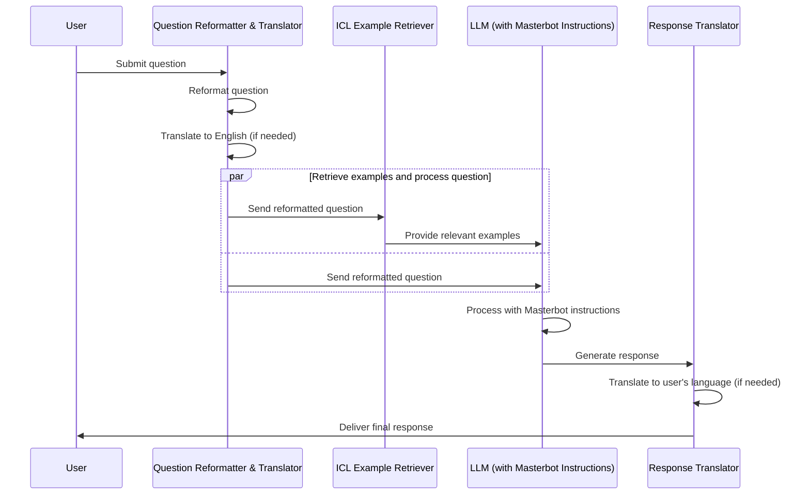

# MasterBots System Diagram - Main DB + ICL v1.1a [SIMPLIFIED]

> At high level...

---

# Masterbots MVP Glossary

## Question Reformatter & Translator

- **Technical**: A component that restructures the user's question for optimal AI processing and translates it to English if necessary.
- **Product**: Ensures that user questions are clear and in a format that our AI can best understand and respond to, regardless of the user's native language.

## ICL Example Retriever

- **Technical**: A microservice or Vercel function that fetches relevant examples based on the user's question to provide context for the LLM.
- **Product**: Enhances the AI's understanding by providing it with similar, previously answered questions or relevant information.

## LLM with Masterbot Instructions

- **Technical**: The main Language Model (e.g., GPT-4) that processes the user's question along with ICL examples, guided by predefined Masterbot instructions.
- **Product**: The core AI that generates high-quality, contextually relevant responses to user queries.

## Response Translator

- **Technical**: A component that translates the LLM's response back to the user's original language if needed.
- **Product**: Ensures that users receive responses in their preferred language, maintaining a seamless experience regardless of language barriers.

## Objectives

1. **Reformat User Questions**: Optimize input for AI processing.
2. **Language Translation**: Enable multilingual support.
3. **Enhance LLM Responses**: Use high-quality prompts, instructions, and examples.
4. **Reduce Response Time**: Optimize the process for faster results.

## MVP Flow

1. Reformat and translate user question
2. Retrieve ICL examples based on the question
3. Process with Masterbot instructions and generate LLM response
4. Translate response if required

## Implementation Considerations

- Decide between using Wordware exclusively or a combination of Wordware and direct LLM API calls for optimal performance and flexibility.
