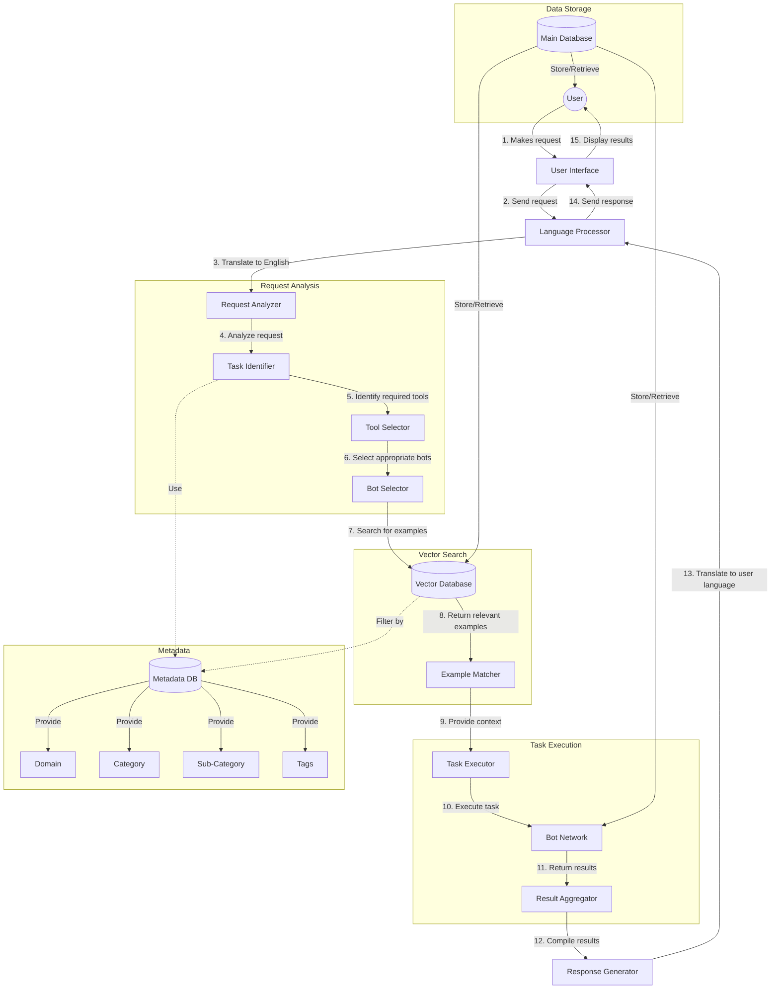

# MasterBots System Diagram - Main DB + ICL (Metadata DB) v1.0a

```mermaid
graph TB
    User((User)) --> |1. Makes request| UI[User Interface]
    UI --> |2. Send request| LangProcessor[Language Processor]
    LangProcessor --> |3. Translate to English| RequestAnalyzer[Request Analyzer]
    
    subgraph "Request Analysis"
        RequestAnalyzer --> |4. Analyze request| TaskIdentifier[Task Identifier]
        TaskIdentifier --> |5. Identify required tools| ToolSelector[Tool Selector]
        ToolSelector --> |6. Select appropriate bots| BotSelector[Bot Selector]
    end
    
    subgraph "Vector Search"
        BotSelector --> |7. Search for examples| VectorDB[(Vector Database)]
        VectorDB --> |8. Return relevant examples| ExampleMatcher[Example Matcher]
    end
    
    subgraph "Task Execution"
        ExampleMatcher --> |9. Provide context| TaskExecutor[Task Executor]
        TaskExecutor --> |10. Execute task| Bots[Bot Network]
        Bots --> |11. Return results| ResultAggregator[Result Aggregator]
    end
    
    ResultAggregator --> |12. Compile results| ResponseGenerator[Response Generator]
    ResponseGenerator --> |13. Translate to user language| LangProcessor
    LangProcessor --> |14. Send response| UI
    UI --> |15. Display results| User
    
    subgraph "Data Storage"
        MainDB[(Main Database)]
        MainDB --> |Store/Retrieve| Bots
        MainDB --> |Store/Retrieve| User
        MainDB --> |Store/Retrieve| VectorDB
    end
    
    subgraph "Metadata"
        MetadataDB[(Metadata DB)]
        MetadataDB --> |Provide| Domain[Domain]
        MetadataDB --> |Provide| Category[Category]
        MetadataDB --> |Provide| SubCategory[Sub-Category]
        MetadataDB --> |Provide| Tags[Tags]
    end
    
    VectorDB -.-> |Filter by| MetadataDB
    TaskIdentifier -.-> |Use| MetadataDB
```
